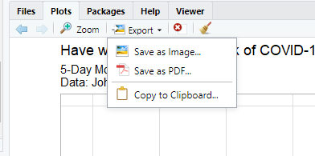
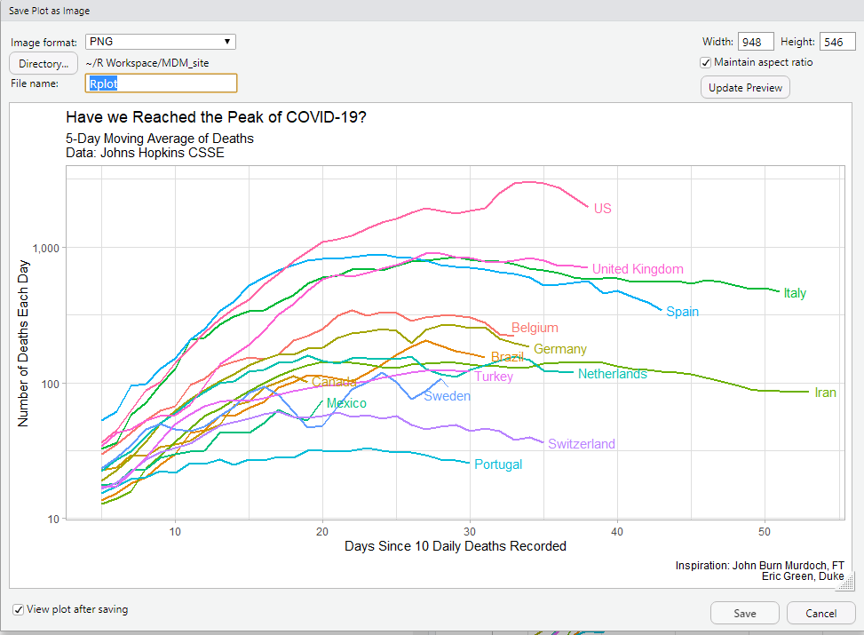

```{r setup, include=FALSE}
knitr::opts_chunk$set(echo = TRUE)
```

Today we will create a plot using the deaths data, and then save the plot as a .png file to upload to Edsby. Hopefully things went reasonably well last week with adding to the plots. If you added more, or changed, counties, you now have a plot of your own. 

Let's save a plot:

# Saving a Plot in R

### 1. Load Libraries and Set a Theme

We will need to use a new package today, so you'll need to install the tibbletime package to allow us to use a folling mean function.

**In the console, please type: install.packages("tibbletime") and run the command.**

In order to work with R, you'll need access to many different packages that allow the user to use different tools. Each of these packages below has a function. Most importantly, the tidyverse package allows the user to import, tidy, transform, and visualize data using commands that are relatively intuitive. 

The other packages each perform some function in this module. 

```{r Libraries, message=FALSE, warning=FALSE}
library(tidyverse)
library(janitor)
library(lubridate)
library(ggrepel)
library(knitr)
library(tibbletime)
```

I have set the theme to light to avoid the gray background in graphics.

```{r}
theme_set(theme_light())
```


### 2. Load the Deaths data in R

We will load the data using the data source of the following website [Johns Hopkins CSSE Map](https://coronavirus.jhu.edu/map.html)

In order to get the data, we will use a link to the Johns Hopkins CSSE data in GitHub. The following command will load the data for us using the `read_csv` command.

```{r Load data, message=FALSE, warning=FALSE}
covid_deaths <- read_csv("https://raw.githubusercontent.com/CSSEGISandData/COVID-19/master/csse_covid_19_data/csse_covid_19_time_series/time_series_covid19_deaths_global.csv")

```

Once you run this line of code, you should see the `covid_deaths` object in the Environment pane. If you click the object in the environment pane, you can view the data in a tabel format in the *Source* pane in the upper left.

#### A. Clean the names

Use the viewer to inspect the data and you'll see we have the same issue that we had last time, so we'll use the same process as last time to convert the data into a usuable (**tidy**) format. Remember, tidy data has one row that represents a single observation. Each row will represent a single day's number of deaths in a single country. 

We would pefer to use *YYYY-MM-DD* as our date input, so we will use the following command to rename the columns with the dates formatted correctly.

```{r}
old_names_deaths <- colnames(covid_deaths)[5:ncol(covid_deaths)]
new_names_deaths <- parse_date(colnames(covid_deaths)[5:ncol(covid_deaths)], "%m/%d/%y")

covid_deaths<- covid_deaths %>% 
  rename_at(vars(old_names_deaths), function(x) new_names_deaths)
```

#### B. Re-shape the Data

Then we will reshape the data into a long *tidy* format using the `pivot_longer()` command. Now for each country observation (row), we will move the dates under the country. We will call this new dataset `covid_deaths_tidy`. You can inspect it in the environment to see how it looks different from the `covid_deaths` that we input from GitHub. 

We'll also assume the `janitor` package is still broken in the 

```{r}
covid_deaths_tidy <- covid_deaths %>% 
  pivot_longer(
    cols = -`Province/State`:-Long,  
    names_to = "date", 
    values_to = "deaths"
  ) %>% as_tibble() %>% 
  mutate(date = as.Date(date)) %>% 
  set_names(tolower(make.names(names(.)))) # The janitor package was broken in the cloud, here is the fix
 
```

#### C. Rank by deaths

```{r, echo=FALSE}
covid_deaths_tidy %>%
  mutate(Country = country.region) %>% 
  group_by(Country) %>% 
  summarise(deaths = max(deaths)) %>%
  filter(Country != "France") %>% 
  arrange(desc(deaths)) %>% 
  slice(1:20) %>% 
  kable()
```

To create a plot that has the names of the countries with the most deaths, we will assign the names to a list called `top_20`, where we will call on it to produce a plot.

## Creating a Plot

# A. Create a Top 20 List

```{r}
top_15 <- 
covid_deaths_tidy %>%
  group_by(country.region) %>% 
  summarise(deaths = max(deaths)) %>%
  filter(country.region != "France") %>% 
  filter(country.region != "China") %>% 
  arrange(desc(deaths)) %>% 
  slice(1:15) 
```


# B. Creating a daily_deaths count

```{r}
covid_daily_deaths <- 
covid_deaths_tidy %>%
  filter(country.region != "France") %>% 
  group_by(country.region, date) %>%
  summarise(deaths = max(deaths)) %>% 
  mutate(daily_deaths = c(deaths[1], diff(deaths))) %>%
  filter(daily_deaths >= 10) %>% 
  mutate(days = 1:n()) %>% 
  mutate(label = if_else(days == max(days), 
                         country.region, 
                         NA_character_)) %>%
  ungroup() 
```


# C. Creating a "Rolling Average" for the daily deaths to smooth out spikes

Remember that you must have installed the `tibbletime` package and also loaded it in the library.

```{r}
roll_mean_5 <- rollify(mean, window = 5) # Create a 5-day rolling average


covid_daily_deaths %>% 
  filter(country.region %in% top_15$country.region) %>%
  group_by(country.region) %>% 
  mutate(deaths_avg = roll_mean_5(daily_deaths)) %>% 
  ungroup() %>% 
  filter(!is.na(deaths_avg)) %>% 
  ggplot(aes(days, deaths_avg, colour = country.region))+
  geom_line(size = .75)+
  geom_text_repel(aes(label = label), 
                  nudge_x = 1, 
                  na.rm = TRUE)+
  scale_y_log10(labels = scales::comma_format())+
  scale_color_discrete(name = "Country")+
  theme(legend.position = "none")+
  labs(title = "Have we Reached the Peak of COVID-19?", 
       x = "Days Since 10 Daily Deaths",
       y = "Number of Deaths Each Day",
       subtitle = "5-Day Moving Average of Deaths\nData: Johns Hopkins CSSE",
       caption = "Inspiration: John Burn Murdoch, FT\nEric Green, Duke")
```


# Save your Plot

In order to save your plot, you have two choices. Firstly, you can save it using the viewer pane in the lower right. 



Once you click the *Export* button, you can change a variety of options about the plots. 



Alternatively, you can choose to save your plot using code by assigning your plot to an object, and then using the `ggsave()` command to save it. See below:


```{r}
plot_1 <-
covid_daily_deaths %>% 
  filter(country.region %in% top_15$country.region) %>%
  group_by(country.region) %>% 
  mutate(deaths_avg = roll_mean_5(daily_deaths)) %>% 
  ungroup() %>% 
  filter(!is.na(deaths_avg)) %>% 
  ggplot(aes(days, deaths_avg, colour = country.region))+
  geom_line(size = .75)+
  geom_text_repel(aes(label = label), 
                  nudge_x = 1, 
                  na.rm = TRUE)+
  scale_y_log10(labels = scales::comma_format())+
  scale_color_discrete(name = "Country")+
  theme(legend.position = "none")+
  labs(title = "Have we Reached the Peak of COVID-19?", 
       x = "Days Since 10 Daily Deaths Recorded",
       y = "Number of Deaths Each Day",
       subtitle = "5-Day Moving Average of Deaths\nData: Johns Hopkins CSSE",
       caption = "Inspiration: John Burn Murdoch, FT\nEric Green, Duke")

ggsave("plot_save_example.png", plot = plot_1, height = 5, width = 7)

```


