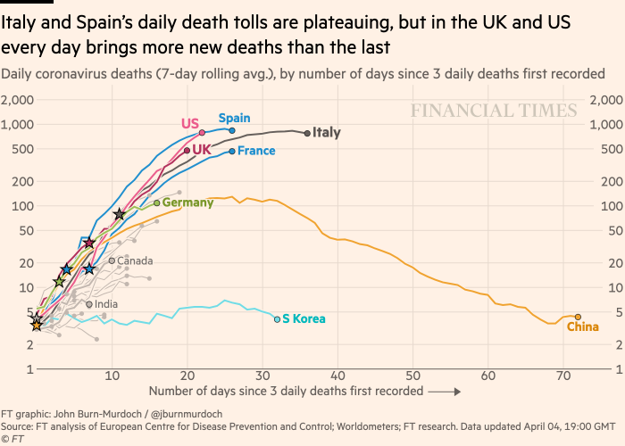

# Welcome to Data Visualization Using RStudio

Welcome! This Arts/Co-curricular Plus program will provide you with the opportunity to learn a new coding langauge called, R. Specifically, we will use the R for Statistical Computing language inside the RStudio IDE to create visualization from a range of data sets. 

To avoid the headaches dealing with remote setup any installation and update of software, we are going to use RStudio.cloud, which only requires a browser to run R. Everything will work "out of the box" and we won't need to deal with any of the usual issues for new users.

For those of you with experience in RStudio, you'll be able to use Rstudio on your machine, but keep in mind that it might be easier to work with RStudio.cloud for these projects so that I can see your projects and code, and help troubleshhot if necessary.

Let's begin by orienting ourselves with RStudio in the first week and work towards create a plot that shows the spread of COVID-19 in different countries around the world.

